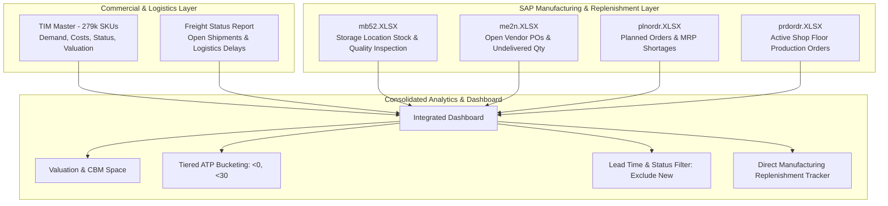

# Consolidated Multi-Source Architecture & Client Requirements

**Document Scope:** Full Data Ecosystem & Integration Architecture for Dashboards  
**Sources:** 
- WhatsApp Audio Directives (`WhatsApp Ptt 2026-09-28 at 09.49.08.ogg`)
- Commercial Master (`TIM 22092026.xlsx`)
- Open Logistics Status (`Freight Status 22092026.XLSX`)
- SAP Manufacturing / Warehouse Extracts (`mb52.XLSX`, `me2n.XLSX`, `plnordr.XLSX`, `prdordr.XLSX`)

---

## 1. Executive Summary & Problem Context

In the audio briefing, the client emphasized:
> *"We can use these 3 files or 4 files to make one consolidated dashboard... We need an enhancement for the second project, which is Internal Doors / Doors & Windows... TIM is for commercial input and master data, but for direct manufacturing replenishment, we take the direct input from SAP."*

The repository now contains all pieces of this ecosystem:
1. **Commercial & Planning Master:** `TIM 22092026.xlsx`
2. **Logistics & Open PO Pipeline:** `Freight Status 22092026.XLSX`
3. **SAP Warehouse Inventory (T-Code MB52):** `mb52.XLSX`
4. **SAP Open Purchasing / Vendor POs (T-Code ME2N):** `me2n.XLSX`
5. **SAP Planned Orders (T-Code MD16/COOIS):** `plnordr.XLSX`
6. **SAP Production Orders (T-Code COOIS):** `prdordr.XLSX`

---

## 2. Complete File Directory & Role Breakdown

### A. Commercial & Master Files

#### 1. `TIM 22092026.xlsx` (Total Inventory Management Master)
- **Role:** Central commercial master file across all divisions (Kitchens, D&W, Furniture).
- **Scope:** 279,419 total catalog items, 79 columns.
- **Key Fields:** Article ID, Category, Status (`New`, `Active`, `Discontinued`), Landed Cost, On-Hand (OH) Stock & Value KD, Monthly Demand History (`Curr`, `Curr-1` to `Curr-12`), and Future Inbound Pipeline (`Inbound Curr` to `Inbound Curr+5`).

#### 2. `Freight Status 22092026.XLSX` (Freight & Open Logistics Pipeline)
- **Role:** Tracks international and local supply shipments currently en route.
- **Key Fields:** `PO#`, `Vendor Name`, `Incoterm`, `Port Delay`, `ETA Delay`, `BAYAN Delay`, `AWH Delay`, `GRP`, `ATP`.

---

### B. SAP Manufacturing & Replenishment Extracts (The "Internal Doors" Project)

These files represent the direct SAP transaction extracts specifically powering manufacturing replenishment and shop floor planning:

#### 3. `mb52.XLSX` (SAP Warehouse Stock by Storage Location)
- **SAP Transaction:** `MB52` (Warehouse Stock Overview)
- **Total Records:** 2,124 rows
- **Role:** Granular stock breakdown across specific DC locations and inspection stages.
- **Key Columns:**
  - `Article`, `Material Description`
  - `Site` (e.g., `1111` Kuwait, `1888` Project DC)
  - `Storage Location` & `Descr. of Storage Loc.` (e.g., `KWT Main DC`)
  - `Unrestricted` (Usable stock) & `Value Unrestricted` (in KWD)
  - `Stock in Transit`, `Transit and Transfer`, `In Quality Insp.`, `Blocked`
- **Use Case:** Provides real-time physical availability without waiting for weekly TIM re-runs.

#### 4. `me2n.XLSX` (SAP Purchase Orders by PO Number / Vendor)
- **SAP Transaction:** `ME2N` (Purchasing Documents by Vendor / Material)
- **Total Records:** 2,184 open PO items
- **Role:** Exact purchase orders placed with hardware, profile, and door vendors.
- **Key Columns:**
  - `Purchasing Document` (PO#) & `Document Date`
  - `Name of Vendor` (e.g., *Starlight Hardware Co.*)
  - `Article`, `Short Text`, `Order Quantity`
  - `Still to be delivered (qty)`: Undelivered open quantity.
  - `Still to be delivered (value)`: Value in currency (`USD`, `EUR`, `KWD`).
  - `Net price`, `Currency`, `Release indicator`.
- **Use Case:** Direct link between open purchasing commitments and expected replenishment dates.

#### 5. `plnordr.XLSX` (SAP Planned Orders)
- **SAP Transaction:** `MD16` / `COOIS` (Planned Orders for MRP Demand)
- **Total Records:** 78,009 requirement records
- **Role:** Planned manufacturing orders generated by MRP to satisfy future customer orders and target buffers.
- **Key Columns:**
  - `Sales Document` & `Pegged requirement`
  - `Article`, `Material Description`
  - `Requirement quantity (EINHEIT)` & `Requirement date`
  - `Open Quantity (EINHEIT)` & `Shortage (EINHEIT)`
  - `Sales Office`, `Order`
- **Use Case:** Forward-looking material shortages and demand schedules for components before production starts.

#### 6. `prdordr.XLSX` (SAP Active Production Orders)
- **SAP Transaction:** `COOIS` (Production Orders on Shop Floor)
- **Total Records:** 6,131 manufacturing orders
- **Role:** Work-in-Progress (WIP) on the factory floor for door frames, panels, and leaves.
- **Key Columns:**
  - `Sales Document` & `Order` (Internal Shop Order Number)
  - `Article`, `Material Description` (e.g., *WPC Door Frame 2400x200mm*)
  - `Requirement quantity`, `Open Quantity`, `Shortage`
  - `Requirement date`, `Sales Office`
- **Use Case:** Tracks active fabrication jobs and identifies material shortages preventing factory completion.

---

## 3. Integrated Dashboard Architecture

---

## 4. Key Synthesis of Client Requirements Across All Files

1. **Category Normalization (`D&W` = `Doors & Windows`):**
   - Standardize all occurrences of `D&W PRODUCTION`, `D&W PRODUCTIONS`, `DOORS & WINDOWS`, and `INTERNAL DOORS` into unified categories.
2. **Interactive Status Filtering:**
   - Allow users to toggle `New` (New Assortment), `Active`, and `Discontinued` so that newly introduced items don't distort overstock or velocity metrics.
3. **ATP Threshold Buckets:**
   - Display cumulative and granular counts for:
     - `ATP < 0` (Backorders / critical shortage)
     - `ATP < 30` (Near stockout warning)
4. **Manufacturing vs. Commercial Alignment:**
   - Connect commercial demand (`Open Sales QTY` from TIM) with shop-floor orders (`prdordr.XLSX`) and planned orders (`plnordr.XLSX`) to give real-time visibility into production shortages.
5. **Purchasing & Logistics Pipeline:**
   - Connect SAP open vendor POs (`me2n.XLSX`) with physical freight shipment status (`Freight Status 22092026.XLSX`) to track delivery ETAs and port/customs delays.
