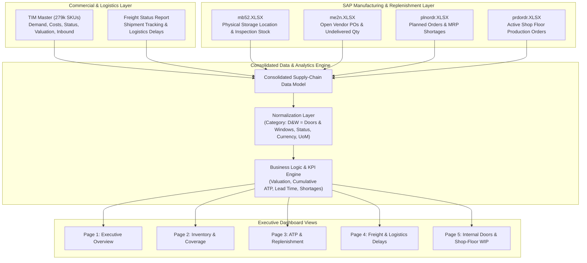

# Consolidated Multi-Source Architecture & Client Requirements Specification

**Document Scope:** Full Data Ecosystem & Integration Architecture for Dashboards  
**Sources:**
- WhatsApp Audio Directives (`WhatsApp Ptt 2026-09-28 at 09.49.08.ogg`)
- Commercial Master (`TIM 22092026.xlsx`)
- Open Logistics Status (`Freight Status 22092026.XLSX`)
- SAP Manufacturing / Warehouse Extracts (`mb52.XLSX`, `me2n.XLSX`, `plnordr.XLSX`, `prdordr.XLSX`)

---

## 1. Executive Summary & Objective

The client requires a **consolidated dashboard** integrating 3 to 4 core data streams (including the TIM Master file, Open PO Freight reports, and SAP manufacturing extracts). The objective is to provide end-to-end operational visibility across inventory, open procurement, manufacturing orders, logistics delays, demand coverage, and replenishment readiness across all product categories (Kitchens, Doors & Windows / Internal Doors, Furniture, etc.).

A central focus is providing an end-to-end solution for the **Internal Doors / Doors & Windows project**, linking commercial demand, open vendor purchase orders, warehouse stock, and shop-floor fabrication orders.

---

## 2. Source Files & Data Inputs

### 2.1. Commercial & Logistics Layer
- **TIM Master File (`TIM 22092026.xlsx`):**
  - Central commercial master containing **79 columns** and **279,419 catalog items**.
  - Contains master data, vendor info, lead times, past order velocities (`Curr` to `Curr-12`), safety stock, target stock, and on-hand figures.
  - Serves as both master catalog data and commercial replenishment planning input.
- **Open Purchase Orders / Freight Status (`Freight Status 22092026.XLSX`):**
  - Tracks active and open PO lines and international/local shipment transit.
  - Monitors vendor delays and milestone progress: ETD, ETA, Port arrival, BAYAN customs clearance, and Warehouse Arrival (AWH).

### 2.2. SAP Manufacturing & Warehouse Layer (The Internal Doors Extension)
Direct manufacturing and operational inputs extracted from SAP:
- **`mb52.XLSX` (SAP T-Code MB52):** Real-time physical inventory by site (`1111`, `1888`), storage location (`KWT Main DC`), unrestricted stock, stock in transit, and quality inspection stock.
- **`me2n.XLSX` (SAP T-Code ME2N):** Open vendor purchase orders, undelivered quantities, values in currency (`USD`, `EUR`, `KWD`), and vendor details.
- **`plnordr.XLSX` (SAP T-Code MD16/COOIS):** Planned production orders (78k+ requirement lines) generated by MRP to satisfy future customer orders, highlighting open quantities and component shortages.
- **`prdordr.XLSX` (SAP T-Code COOIS):** Active production orders (6k+ lines) on the factory floor for door frames, panels, and leaves, tracking work-in-progress (WIP) and fabrication shortages.

---

## 3. Core KPIs & Functional Requirements

### 3.1. Inventory Valuation & Physical Volume
- **Total Inventory Valuation (KD):** Aggregate monetary value of on-hand inventory in Kuwaiti Dinars, with drill-down by Category and Anchor Group.
- **Warehouse Space Utilization (CBM):** Total cubic meters ($m^3$) occupied in the warehouse, broken down by category and country.

### 3.2. Days of Coverage (DoC)
- Calculate demand-based Days of Coverage:
  $$\text{Days of Coverage} = \frac{\text{Current Available Stock}}{\text{Average Daily Demand}}$$
- Show how many days current stock will last based on historical sales / demand run-rate.
- Available at both SKU level and rolled up by category.

### 3.3. Article Status Filtering & "New Assortment" Isolation
The `Article Status - New` field contains:
- `Active`
- `Active Seasonal`
- `New` (New Assortment)
- `Discontinued`

**Requirement:** Provide a top-level interactive filter/toggle allowing users to include or exclude statuses, particularly `New`.  
**Reason:** Newly introduced articles with zero or initial stock must not distort overstock, demand velocity, or replenishment calculations.

### 3.4. ATP (Available To Promise) Threshold Bucketing
Provide tiered SKU-count metrics for ATP by category:
- **`ATP < 0`**: Backordered / overcommitted SKUs where demand exceeds available stock.
- **`0 <= ATP < 30`**: Fast-depleting SKUs approaching stockout.
- **Cumulative Threshold View:** Dashboard cards must support cumulative counting:
  $$\text{Under 30 Cumulative Count} = \text{Count}(\text{ATP} < 0) + \text{Count}(0 \le \text{ATP} < 30)$$
  *(Example: 4 items under 0 + 15 additional items under 30 = 19 items requiring urgent attention).*

### 3.5. Average Lead Time by Category
- Display average supplier lead time in days for each category.
- Highlight categories with longer replenishment cycles that require earlier purchasing decisions.

### 3.6. Stock vs. Commitment vs. Availability Flow
Summarize and visualize the operational balance:
$$\text{On-Hand Stock (OH)} \quad\longrightarrow\quad \text{Committed / Open Sales QTY} \quad\longrightarrow\quad \text{Available to Promise (ATP)}$$

### 3.7. Inbound Pipeline & Next-Month Visibility
Track inbound replenishment due across time buckets:
- **`Inbound Curr`**: Current month arrivals.
- **`Inbound Curr+1`**: Next month scheduled arrivals.
- Compare incoming supply against open order requirements to avoid redundant re-ordering.

---

## 4. Multi-Source Integration Architecture

---

## 5. Synthesis of Business Rules Across All Files

1. **Category Normalization:**
   - Standardize all occurrences of `D&W PRODUCTION`, `D&W PRODUCTIONS`, `DOORS & WINDOWS`, and `INTERNAL DOORS` into a unified category architecture.
2. **Interactive Status Filtering:**
   - Allow toggling `New`, `Active`, `Active Seasonal`, and `Discontinued` so that new assortments are excluded from overstock and velocity calculations.
3. **ATP Threshold Buckets:**
   - Display both granular and cumulative counts (`ATP < 0` and `ATP < 30`).
4. **Manufacturing vs. Commercial Alignment:**
   - Connect commercial demand (`Open Sales QTY` from TIM) with shop-floor orders (`prdordr.XLSX`), planned orders (`plnordr.XLSX`), and physical inventory (`mb52.XLSX`) to provide clear visibility into production shortages.
5. **Purchasing & Logistics Pipeline:**
   - Link SAP open vendor POs (`me2n.XLSX`) with logistics milestones (`Freight Status 22092026.XLSX`) to track PO delivery ETAs, port delays, customs (BAYAN) delays, and warehouse receipt readiness.

---

## 6. Recommended 5-Page Dashboard Structure

| Page | Title | Key Metrics & Visualizations |
| :--- | :--- | :--- |
| **Page 1** | **Executive Overview** | Total Valuation (KD), Total Volume (CBM), Open Sales QTY, ATP, Days of Coverage, Category Lead Times, Inbound Curr & Curr+1, Global Filters (Category, Country, Status). |
| **Page 2** | **Inventory & Coverage** | Valuation by Category, CBM Space utilization, Days of Coverage distribution curves, On-Hand vs. Committed vs. ATP balance, SKU drill-down. |
| **Page 3** | **ATP & Replenishment** | Tiered ATP breakdown (`< 0`, `< 30`), Cumulative critical SKU count, Category ATP health matrix, Lead Time vs. Re-order Requirements. |
| **Page 4** | **Freight & Logistics** | Open PO quantity & value, Vendor-wise order commitments, ETD/ETA tracking, Port delays, BAYAN customs delays, AWH arrival status. |
| **Page 5** | **Internal Doors / Manufacturing** | SAP Unrestricted vs. Quality Inspection stock, Open purchasing (`me2n`), Planned orders (`plnordr`), Active shop-floor orders (`prdordr`), Component shortages, Job order requirement dates. |

---

## 7. Data Quality, Validation & Refresh Workflow

The integration pipeline validates:
- Consistent Article / Material ID mapping between TIM and SAP.
- Conversion of purchase currencies (`USD`, `EUR`, `KWD`) to uniform reporting currency.
- Identification of orphaned records (articles in SAP without TIM master records, or vice versa).
- Clear tracking of dataset timestamps and repeatable refresh routines when new weekly source files arrive.
