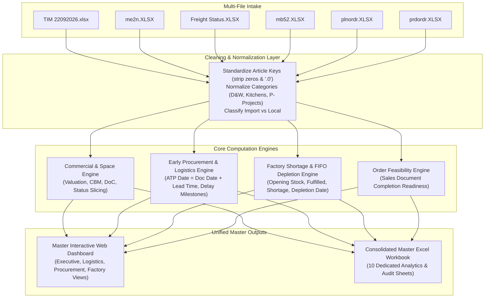

# Unified Master Data Engine & Output Specification (`MASTER_VIEW.md`)

Comprehensive specification for the **Unified Master File Ingestion & Output Engine**. 

In this unified master setup, the user uploads all **6 core operational datasets** in a single multi-file dropzone and receives a consolidated intelligence interface plus an exportable multi-tab **Master Excel Workbook** containing every cross-functional metric, shortage prediction, and logistics audit.

---

## 1. Unified Multi-Upload Input Ecosystem

The user uploads the following 6 files into a single unified intake pipeline:

| # | File Type / Name | Role & Ingestion Priority | Key Fields Extracted |
| :-: | :--- | :--- | :--- |
| **1** | **`TIM Master`** (`TIM 22092026.xlsx`) | **Commercial Catalog Backbone** | `Article`, `Anchor Grouping`, `Category`, `Sub Category`, `Vendor`, `Buying Price`, `OH Stock`, `OH Value KD`, `OH CBM`, `Open Sales QTY`, `ATP QTY`, `Lead Time`, `Country Sales Monthly Mean QTY`, `Article Status - New` |
| **2** | **`ME2N`** (`me2n.XLSX`) | **Early Procurement (Point-of-Placement)** | `Purchasing Document` (PO#), `Document Date`, `Site`, `Name of Vendor`, `Article`, `Order Quantity`, `Still to be delivered (qty)`, `Net Order Value`, `Still to be delivered (value)`, `Currency` |
| **3** | **`Freight Status`** (`Freight Status 22092026.XLSX`) | **In-Transit Shipping & Customs** | `PO#`, `Article`, `Container`, `Status` (EXF, ETD, ETA, BAYAN, AWH, GRP), `POOpenQty`, `InbValKWD`, `Vendor Ctry`, `Over All Delay`, Delay columns (`EXF Delay`, `ETA Delay`, `BAYAN Delay`, `AWH Delay`, `Port Delay`) |
| **4** | **`MB52`** (`mb52.XLSX`) | **Physical Plant Bin Stock** | `Article`, `Site`, `Storage Location`, `Unrestricted`, `Value Unrestricted`, `Transit and Transfer`, `Stock in Transit`, `Blocked`, `Value BlockedStock` |
| **5** | **`PLNORDR`** (`plnordr.XLSX`) | **Planned MRP Production Demand** | `Sales Document`, `Order` (Planned Order ID), `Article`, `Requirement quantity`, `Requirement date`, `Phantom item`, `Sales Office` |
| **6** | **`PRDORDR`** (`prdordr.XLSX`) | **Active Shop-Floor Manufacturing** | `Sales Document`, `Order` (Production Order ID), `Article`, `Requirement quantity`, `Requirement date`, `Phantom item`, `Sales Office` |

---

## 2. Master Data Harmonization & Join Architecture



---

## 3. All Deliverables & Outputs Generated by the Master View

When all files are loaded, the master engine generates two primary deliverables:
1. **An Interactive Multi-Perspective Web Application** (with instant category/country/status filtering).
2. **An Exportable Consolidated Master Excel Workbook (`Unified_Master_Supply_Chain_Intelligence.xlsx`)** featuring 10 dedicated analysis tabs.

---

### Tab 1: `Executive_Commercial_Summary` (From TIM + MB52)
A top-level strategic overview of inventory assets, warehouse space, and sales coverage:

| Output Column | Description / Mathematical Formula |
| :--- | :--- |
| **Category** | Normalized Division (`KITCHEN`, `DOORS & WINDOWS`, `INTERNAL DOORS`, `FURNITURE`, etc.) |
| **Active SKUs** | Total catalog items excluding `Discontinued` |
| **New Assortment SKUs** | Count of items marked `New` (New Assortment) |
| **Total OH Stock** | Physical units on-hand across all warehouses |
| **Inventory Valuation (KD)** | $\sum (\text{OH Value KD})$ |
| **Warehouse Space (CBM)** | $\sum (\text{OH CBM})$ |
| **Average Days of Coverage (DoC)** | $\frac{\text{Total OH Stock}}{\text{Total Monthly Sales Mean} / 30}$ |
| **Open Sales Commitments** | $\sum (\text{Open Sales QTY})$ |
| **Available to Promise (ATP)** | $\sum (\text{ATP QTY}) = \text{Total OH Stock} - \text{Open Sales Commitments}$ |
| **Average Lead Time (Days)** | $\text{Mean}(\text{Lead Time})$ |

---

### Tab 2: `ATP_Threshold_Risk_Distribution` (Mandatory Audio Directive)
Category-level SKU distribution monitoring stockout risks:

| Output Column | Description / Mathematical Formula |
| :--- | :--- |
| **Category** | Product Category |
| **Negative ATP SKUs (`< 0`)** | Overcommitted items where customer reservations exceed stock ($\text{ATP} < 0$) |
| **Critical Runway SKUs (`0 to 30`)**| Items approaching depletion within 30 days/units ($0 \le \text{ATP} < 30$) |
| **Total At-Risk SKUs (`< 30`)** | **Cumulative Count:** $\text{Count}(\text{ATP} < 0) + \text{Count}(0 \le \text{ATP} < 30)$ |
| **Healthy Stock SKUs (`> 30`)** | Adequately buffered catalog items |
| **At-Risk Stock Value (KD)** | Total monetary valuation of items falling below 30 ATP |

---

### Tab 3: `Early_Procurement_Pipeline` (From ME2N + TIM Lead Times)
The client's preferred **unlagged order placement list** capturing items as soon as POs are entered in SAP:

| Output Column | Description / Mathematical Formula |
| :--- | :--- |
| **PO# (`EBELN`)** | SAP Purchase Order Number |
| **Document Date (`BEDAT`)** | Official PO placement date in SAP |
| **Article & Description** | Material ID and trade name |
| **Vendor Name** | Supplier company name |
| **Order Quantity** | Originally ordered units |
| **Still to be Delivered (Qty)** | Remaining undelivered units |
| **Net Order Value** | Total line value in PO currency |
| **Currency** | `USD`, `SAR`, `KWD`, `EUR`, `AED` |
| **TIM Lead Time (Days)** | Supplier manufacturing and logistics cycle from TIM Master |
| **Projected Inbound ATP Date** | $\mathbf{\text{Document Date (ME2N)}} + \mathbf{\text{Lead Time (TIM)}}$ |
| **Pipeline Month Bucket** | Classified into `Current`, `Current+1`, `Current+2` based on Projected ATP Date |

---

### Tab 4: `Logistics_Shipping_Delays` (From Freight Status)
Detailed tracking of approved, in-motion international and regional shipments:

| Output Column | Description / Mathematical Formula |
| :--- | :--- |
| **PO# & Article** | Purchase Order and SKU identifier |
| **Shipping Status** | Milestone stage: `EXF`, `ETD`, `ETA`, `BAYAN`, `AWH`, `GRP` |
| **Container # & Size** | Logistics container details |
| **Vendor Country** | Origin country (`SA`, `KW`, `IT`, `CN`, `AE`, `ES`, `GR`) |
| **Import / Local** | Sourcing stream: `Local` (KW/SA) vs. `Import` |
| **Milestone Delay Breakdown** | Days delayed at each gate: `EXF`, `ETD`, `ETA`, `BAYAN`, `AWH`, `Port` |
| **Total PO Delay Days** | $\sum \text{Stage Delays}$ |
| **Over All Delay Days** | Overall end-to-end logistics latency |
| **Inbound Value (KWD)** | Shipment value in Kuwaiti Dinars |
| **Capital at Risk Flag** | Flagged as `EXPOSED AT RISK` if $\text{Over All Delay} > 0$ |

---

### Tab 5: `Physical_Warehouse_Bins` (From MB52)
Real-time stock audit across storage locations and plants:

| Output Column | Description / Mathematical Formula |
| :--- | :--- |
| **Site / Plant** | Plant code: `1111` (Kuwait DC), `1888` (Kuwait Factory), `9101` (Saudi DC) |
| **Storage Location & Name** | Physical warehouse bin / staging area (e.g. `KWT Main DC`, `Doha2 New WS`) |
| **Article & Description** | Material master details |
| **Unrestricted Stock** | Usable, pickable inventory units |
| **Value Unrestricted (KD/SAR)** | Inventory valuation of usable stock |
| **Transit / Transfer Stock** | Stock physically in transit between sites/locations |
| **Blocked / Quarantine Stock** | Damaged, expired, or non-conforming items |
| **Value Blocked Stock** | Financial capital locked in defective inventory |

---

### Tab 6: `Shop_Floor_Shortage_Bottlenecks` (From PRDORDR + MB52)
Active factory floor work orders experiencing material starvation:

| Output Column | Description / Mathematical Formula |
| :--- | :--- |
| **Production Order ID (`AUFNR`)** | SAP active fabrication job number (e.g. `3001150362`) |
| **Sales Document (`VBELN`)** | Customer contract / sales order linked to this fabrication run |
| **Missing Article & Description** | Raw component causing stoppage (frame, adhesive, hinge, architrave) |
| **Scheduled Requirement Date** | Date required on the shop floor |
| **Required Quantity** | Component units required |
| **Physical Stock Available** | Usable stock in warehouse (`MB52`) |
| **Active Shortage Quantity** | **Missing units stalling factory execution** |
| **Shortage Severity** | `CRITICAL STOPPAGE` if available stock is 0 |

---

### Tab 7: `Planned_MRP_Demand_Forecast` (From PLNORDR + MB52)
Forward material requirements planning for projected manufacturing assembly:

| Output Column | Description / Mathematical Formula |
| :--- | :--- |
| **Planned Order ID (`PLNUM`)** | SAP MRP Planned Order ID (e.g. `59714488`) |
| **Sales Document** | Future customer sales contract |
| **Required Article & Description** | BOM component required |
| **Requirement Date** | Projected production start date |
| **Projected Demand Quantity** | Units needed |
| **Projected Shortage Quantity** | Component gap not covered by current warehouse inventory |
| **Covering Open PO#** | Matching open purchase order in `ME2N` scheduled to cover this demand |

---

### Tab 8: `FIFO_Stock_Depletion_Timeline` (Harsh2 Chronological Engine)
Chronological consumption audit showing the exact point of stock exhaustion:

| Output Column | Description / Mathematical Formula |
| :--- | :--- |
| **Article & Description** | Material identifier |
| **Initial Available Stock** | $\text{Unrestricted} + \text{Transit}$ (from MB52) |
| **Requirement Date** | Chronological demand date |
| **Sales Document / Order** | Customer or production order consuming inventory |
| **Opening Stock Balance** | Available inventory prior to this order |
| **Order Demand Qty** | Quantity demanded |
| **Fulfilled Quantity** | $\min(\text{Demand Qty}, \max(0, \text{Opening Balance}))$ |
| **Remaining Shortage Qty** | $\text{Demand Qty} - \text{Fulfilled Quantity}$ |
| **Projected Ending Balance** | $\text{Opening Balance} - \text{Demand Qty}$ |
| **Stock Depletion Date** | **First date where Projected Balance turns negative** |
| **Runway (Days Until Depletion)**| $\text{Stock Depletion Date} - \text{Current Date}$ |

---

### Tab 9: `Sales_Order_Fulfillment_Matrix` (Customer Delivery Readiness)
Customer order feasibility view grouping multi-component requirements:

| Output Column | Description / Mathematical Formula |
| :--- | :--- |
| **Sales Document (`VBELN`)** | Customer Sales Document / SIC |
| **Earliest / Latest Delivery Date**| Customer promised delivery dates |
| **Total Component Lines** | Number of distinct components required for this custom order |
| **Total Ordered Quantity** | Total units demanded across all parts |
| **Deliverable Quantity** | Units with 100% warehouse stock coverage |
| **Shortage Quantity** | Units missing across all BOM items |
| **SO Fulfillment Rate (%)** | $\frac{\text{Deliverable Qty}}{\text{Total Ordered Qty}} \times 100$ |
| **Delivery Feasibility Status** | `READY FOR FULL DELIVERY` (100%), `PARTIAL RISK`, `UNFULFILLABLE (NO STOCK)` |
| **Stalling Bottleneck Articles** | List of specific component IDs preventing order release |

---

### Tab 10: `Data_Compliance_Audit_Log` (From Dash Anomaly Engine)
Automated validation log detailing process and data integrity violations:

| Output Column | Description / Mathematical Formula |
| :--- | :--- |
| **Row ID & PO#** | Line identifier and Purchase Order number |
| **Vendor & Category** | Supplier and category details |
| **Violation Rule** | Rule violated (e.g. `ATP_BEFORE_GRP`, `ATP_BEFORE_BAYAN`, `TIM_MISSING_PLANNER`) |
| **Issue Details** | Human-readable explanation of the data mismatch |
| **Severity Level** | `Severe` (Import lines with date anomalies) vs. `Medium` (Local lines) |
| **Milestone Timestamps** | Audit timestamps: `ATP`, `GRP`, `AWH`, `BAYAN`, `ETA`, `ETD` |

---

## 4. Visual KPI Metric Cards Specification (Consolidating Dash, Harsh2 & TIM)

The master dashboard features a tiered KPI metric system, capturing every key operational indicator from **`Dash`** (Freight Status & Inbound Logistics), **`Harsh2`** (SAP MB52, COHV Planned & Production Shortages), and the **`TIM Master`** (Audio Note Directives).

---

### 4.1. Core Executive Strip (Top Level Header Cards)
| # | KPI Card Title | Mathematical Formula | Source System | Significance & Alert Threshold |
| :-: | :--- | :--- | :---: | :--- |
| **1** | **Total Inventory Valuation** | $\sum \text{OH Value KD}$ (TIM) + $\sum \text{Value Unrestricted}$ (MB52) | `TIM` / `MB52` | Total gross on-hand asset capital |
| **2** | **Warehouse Space (CBM)** | $\sum \text{OH CBM}$ ($m^3$) | `TIM` | Total occupied storage volume; alert at $> 85\%$ |
| **3** | **Cumulative At-Risk ATP (<30)**| $\text{Count}(\text{ATP} < 0) + \text{Count}(0 \le \text{ATP} < 30)$ | `TIM` | **Mandatory Audio Directive**: Immediate stockout threat |
| **4** | **Unlagged Placed PO Pipeline** | $\sum \text{Still to be delivered (val.)}$ | `ME2N` | Client preferred: unlagged pipeline before shipping approval |
| **5** | **Logistics Capital at Risk** | $\sum_{\text{Over All Delay} > 0} \text{InbValKWD}$ | `Dash` (`FS`) | Commercial capital tied up in delayed freight containers |
| **6** | **Overall Tracking Delay Rate** | $\frac{\text{Delayed PO Count}}{\text{Total Audited POs}} \times 100$ | `Dash` (`FS`) | Percentage of active POs suffering logistics delays |
| **7** | **Active Shop-Floor Shortages** | $\sum \text{Shortage Qty}$ (Active Runs) | `Harsh2` (`prdordr`) | Physical missing units stalling assembly lines |
| **8** | **Customer SO Readiness Rate** | $\frac{\text{100% Deliverable SOs}}{\text{Total Active SOs}} \times 100$ | `Harsh2` | Percentage of customer sales orders ready for full delivery |

---

### 4.2. Specific Logistics & Supply Chain KPIs (From `Dash` Repository)
These KPIs monitor shipment gate health, carrier performance, and process compliance across international and local routes:

| KPI Metric Name | Calculation / Formula | Origin Source | Business Role |
| :--- | :--- | :---: | :--- |
| **Total Distinct POs** | $\text{Distinct Count}(\text{PO\#})$ | `Dash` | Total active purchase orders monitored in the logistics pipeline |
| **Total Unique Vendors** | $\text{Distinct Count}(\text{Vendor Name})$ | `Dash` | Active supplier base currently fulfilling shipments |
| **Total Containers in Transit** | $\text{Distinct Count}(\text{Container \#})$ | `Dash` | Physical container tracking across ocean and land freight |
| **Import Portfolio Value** | $\sum_{\text{Import}} \text{InbValKWD}$ | `Dash` | Gross monetary value of all international shipments |
| **Import Delayed Value at Risk**| $\sum_{\text{Import \& Over All Delay} > 0} \text{InbValKWD}$ | `Dash` | Overseas capital exposed to port, customs, or transit delays |
| **Import Financial Risk Rate** | $\frac{\text{Import Delayed Value}}{\text{Import Portfolio Value}} \times 100$ | `Dash` | Percentage of international supply chain capital delayed |
| **Average Import Delay Days** | $\text{Mean}(\text{Over All Delay})_{\text{Import Delayed}}$ | `Dash` | Average turnaround latency for delayed foreign shipments |
| **Local Portfolio Value** | $\sum_{\text{Local}} \text{InbValKWD}$ | `Dash` | Gross monetary value of Kuwait and Saudi domestic orders |
| **Local Delayed Value at Risk** | $\sum_{\text{Local \& Over All Delay} > 0} \text{InbValKWD}$ | `Dash` | Domestic capital exposed to local factory/transit delays |
| **Local Financial Risk Rate** | $\frac{\text{Local Delayed Value}}{\text{Local Portfolio Value}} \times 100$ | `Dash` | Percentage of domestic supply chain capital delayed |
| **Average Local Delay Days** | $\text{Mean}(\text{Over All Delay})_{\text{Local Delayed}}$ | `Dash` | Average fulfillment latency for local suppliers |
| **Milestone Delay Counts** | $\text{Count}(\text{PO\# with } \text{Stage Delay} > 0)$ for each stage | `Dash` | Specific delays across `EXF`, `ETD`, `ETA`, `BAYAN`, `AWH`, `GR`, `PORT` |
| **Total Milestone Delays** | $\sum (\text{EXF} + \text{ETD} + \text{ETA} + \text{BAYAN} + \text{AWH} + \text{GR} + \text{PORT})$ | `Dash` | Total milestone failure touchpoints across all POs |
| **Total Process Violations** | $\text{Count}(\text{PO\# with Issue Count} > 0)$ | `Dash` | Orders violating chronological date rules or missing TIM data |
| **Process Anomaly Rate (%)** | $\frac{\text{Violated PO Count}}{\text{Total Audited POs}} \times 100$ | `Dash` | Data compliance rate (e.g. ATP before Bayan/AWH, dock gap $> 5$d) |
| **Severe Compliance Anomalies** | $\text{Count}(\text{Violations where Import}) $ | `Dash` | Critical sequence errors on high-value import shipments |
| **Month-Bucket Delay Rate** | $\frac{\text{Delayed POs in Bucket } b}{\text{Total POs in Bucket } b} \times 100$ | `Dash` | Trend comparison across `Current`, `Current-1`, and `Current-2` |

---

### 4.3. Specific Manufacturing & Factory Shortage KPIs (From `Harsh2` Repository)
These KPIs monitor component availability, depletion forecasting, and customer order completeness on the shop floor:

| KPI Metric Name | Calculation / Formula | Origin Source | Business Role |
| :--- | :--- | :---: | :--- |
| **Initial Available Plant Stock** | $\sum (\text{Unrestricted} + \text{Transit Stock})_{\text{MB52}}$ | `Harsh2` | Usable raw material inventory on the factory floor |
| **Total Plant Stock Valuation** | $\sum (\text{Value Unrestricted} + \text{Value Transit})_{\text{MB52}}$| `Harsh2` | Real-time monetary valuation of available production inventory |
| **Blocked / Quarantine Stock** | $\sum \text{Blocked Qty}$ & $\sum \text{Value Blocked}$ | `Harsh2` | Damaged or non-conforming stock locked from consumption |
| **Total Scheduled Demand Qty** | $\sum \text{Requirement Quantity (EINHEIT)}$ | `Harsh2` | Gross component demand from combined planned & active orders |
| **Total Scheduled Demand Value**| $\sum (\text{Demand Qty} \times \text{Unit Price})$ | `Harsh2` | Monetary value of all scheduled manufacturing jobs |
| **Total Fulfilled Quantity** | $\sum \text{Fulfilled Qty}$ (via FIFO allocation) | `Harsh2` | Component volume with confirmed 100% warehouse stock coverage |
| **Total Shortage Quantity** | $\sum \text{Shortage Qty} = \text{Demand Qty} - \text{Fulfilled Qty}$ | `Harsh2` | Net missing component volume preventing order completion |
| **Total Shortage Valuation** | $\sum (\text{Shortage Qty} \times \text{Unit Price})$ | `Harsh2` | Financial value of unfulfilled manufacturing demand |
| **Overall Factory Fulfillment %** | $\frac{\text{Total Demand Qty} - \text{Total Shortage Qty}}{\text{Total Demand Qty}} \times 100$| `Harsh2` | Overall manufacturing material sufficiency index |
| **Critical Stockout SKU Count** | $\text{Count}(\text{Initial Stock} \le 0 \text{ \& Demand} > 0)$ | `Harsh2` | Articles with zero stock facing immediate factory stoppage |
| **Stockout Risk SKU Count** | $\text{Count}(\text{Net Projected Balance} < 0)$ | `Harsh2` | Articles whose forward demand exceeds starting stock |
| **Sufficient Stock SKU Count** | $\text{Count}(\text{Net Projected Balance} \ge 0)$ | `Harsh2` | Articles with 100% material coverage through scheduled runs |
| **Earliest Stock Depletion Date**| $\min_{\text{Projected Balance} < 0}(\text{Requirement Date})$ | `Harsh2` | Exact calendar day the factory will experience stockout |
| **Days on Hand (DOH / Runway)** | $\frac{\text{Total Stock Value}}{\text{Total Demand Value} / 30}$ | `Harsh2` | Manufacturing runway based on a 30-day scheduled run rate |
| **Impacted Customer SICs Count** | $\text{Distinct Count}(\text{Sales Document with Shortage})$ | `Harsh2` | Customer sales orders blocked by component shortages |
| **SO Ready for Delivery Count** | $\text{Count}(\text{Sales Document with Shortage Qty} \le 0)$ | `Harsh2` | Customer orders that can be manufactured/shipped immediately |
| **SO Partial Delivery Risk Count**| $\text{Count}(\text{Shortage} > 0 \text{ \& Deliverable} > 0)$ | `Harsh2` | Orders where some components are ready but others missing |
| **SO Unfulfillable Count** | $\text{Count}(\text{Deliverable Qty} \le 0)$ | `Harsh2` | Customer orders with 0% stock coverage |
| **SO Fulfillment Percentage** | $\frac{\text{Deliverable Qty}}{\text{Total Ordered Qty}} \times 100$ | `Harsh2` | Line-item completion percentage per customer contract |

---

### 4.4. Commercial & Planning KPIs (From `TIM Master` & Voice Note)
| KPI Metric Name | Calculation / Formula | Origin Source | Business Role |
| :--- | :--- | :---: | :--- |
| **Catalog Active Articles** | $\text{Count}(\text{Article where Status} \ne \text{Discontinued})$ | `TIM` | Active commercial catalog base |
| **New Assortment Articles** | $\text{Count}(\text{Article where Status} = \text{New})$ | `TIM` | **Voice Note Filter**: Isolated from demand run-rates |
| **Average Supplier Lead Time** | $\text{Mean}(\text{Lead Time})_{\text{Category}}$ | `TIM` | **Voice Note**: Category replenishment lead time in days |
| **Days of Coverage (DoC)** | $\frac{\text{OH Stock}}{\text{Country Sales Monthly Mean QTY} / 30}$ | `TIM` | **Voice Note**: SKU and category sales runway in days |
| **Negative ATP Count** | $\text{Count}(\text{ATP QTY} < 0)$ | `TIM` | **Voice Note**: Backordered/overcommitted commercial SKUs |
| **Critical Low ATP Count** | $\text{Count}(0 \le \text{ATP QTY} < 30)$ | `TIM` | **Voice Note**: Fast-depleting SKUs approaching stockout |
| **Commercial Stock Balance** | $\text{OH Stock} - \text{Open Sales QTY} = \text{ATP QTY}$ | `TIM` | **Voice Note**: Complete balance equation |
| **Next-Month Inbound Pipeline**| $\sum \text{Inbound Curr+1}$ | `TIM` | **Voice Note**: Replenishment arriving in upcoming month |

---

## 5. Master Charts & Visual Graphs Catalog (By Dedicated View)

### View 1: Executive Commercial & Inventory Balance (`TIM` + `MB52`)

#### Chart 1.1: Available To Promise (ATP) Risk Distribution
- **Chart Type:** Dual-Layer Donut Chart with Center Counter & Cumulative Toggle
- **Data Dimension:**
  - Segment 1 (Crimson Red): **Negative ATP (`ATP < 0`)** — Backordered & overcommitted.
  - Segment 2 (Amber Gold): **Critical Low ATP (`0 <= ATP < 30`)** — Imminent stockout danger.
  - Segment 3 (Emerald Green): **Healthy Stock (`ATP >= 30`)** — Buffered inventory.
- **Interactive Audio Note Feature:**  
  Toggle button: **"Show Cumulative At-Risk (< 30)"** that merges segments 1 & 2 into an overarching high-risk block.

#### Chart 1.2: Supplier Lead Time vs. Days of Coverage (DoC) Matrix
- **Chart Type:** 4-Quadrant Bubble Scatter Plot
- **Axes:**
  - **X-Axis:** Supplier Lead Time (Calendar Days: 0 to 180 days).
  - **Y-Axis:** Days of Coverage (0 to 365+ days).
  - **Bubble Size:** Total Inventory Valuation (KD).
  - **Bubble Color:** Category (`KITCHEN`, `DOORS & WINDOWS`, `INTERNAL DOORS`, `FURNITURE`).
- **Strategic Quadrant Analysis:**
  - *Bottom-Right (Danger Zone):* High Lead Time ($> 90$ days) + Low Coverage ($< 30$ days) $\rightarrow$ Urgent PO placement required.
  - *Top-Left (Excess Buffer):* Short Lead Time ($< 30$ days) + High Coverage ($> 180$ days) $\rightarrow$ Potential overstock capital lockup.

#### Chart 1.3: Commercial Stock Commitment Balance
- **Chart Type:** Multi-Bar Comparative Grouped Chart
- **Categories:** Grouped by Product Category (`KITCHEN`, `DOORS & WINDOWS`, etc.)
- **Bars per Category:**
  - Bar 1 (Navy Blue): **Physical On-Hand Stock (`OH Stock`)**
  - Bar 2 (Orange): **Committed Customer Sales (`Open Sales QTY`)**
  - Bar 3 (Teal): **Net Available to Promise (`ATP QTY`)**
  - Bar 4 (Purple): **Next-Month Inbound Supply (`Inbound Curr+1`)**

#### Chart 1.4: Warehouse Space Allocation (CBM) Treemap
- **Chart Type:** Interactive Hierarchical Treemap
- **Hierarchy:** Country (`Kuwait` vs. `Saudi Arabia`) $\rightarrow$ Plant / Storage Location $\rightarrow$ Category.
- **Color Metric:** Space utilization volume ($m^3$) and growth rate.

---

### View 2: Early Procurement & Inbound Logistics (`ME2N` + `Freight Status`)

#### Chart 2.1: End-to-End Milestone Logistics Delay Waterfall
- **Chart Type:** Stage-Gate Funnel / Horizontal Waterfall Chart
- **Stages:**
  1. `EXF` (Ex-Factory Latency at Supplier)
  2. `ETD` (Origin Port Departure Delays)
  3. `ETA` (Ocean Transit Delays)
  4. `BAYAN` (Kuwait Customs Clearing Delay)
  5. `AWH` (At-Warehouse Offloading Latency)
  6. `GR` (Goods Receipt & Dock-to-Stock Processing)
- **Visual Values:** Delayed PO count and Average Delay Days per milestone, instantly pinpointing whether delays originate abroad (vendor EXF) or locally (Bayan customs).

#### Chart 2.2: Point-of-Placement Inbound Supply Horizon (The Derived ATP Timeline)
- **Chart Type:** Stacked Timeline Bar Chart / Forward Horizon Forecast
- **Horizontal Axis:** Rolling Month Buckets (`Current`, `Current+1`, `Current+2`, `Current+3`, `Current+4`, `Current+5`).
- **Vertical Axis:** Incoming Units & Financial Spend.
- **Series:**
  - Series A: **ME2N Projected PO Arrivals** (Calculated as $\text{Document Date} + \text{Lead Time}$).
  - Series B: **Approved Shipping Inbounds** (from `Freight Status` based on verified carrier ETA).
- **Insight:** Highlights incoming inventory before freight shipping lists are published.

#### Chart 2.3: Import vs. Local Financial Risk Exposure
- **Chart Type:** Side-by-Side Semi-Circle Gauge / Donut Comparison
- **Visuals:**
  - Left Gauge: **Import Portfolio** (Gross Value vs. Delayed Capital at Risk in KWD).
  - Right Gauge: **Local Portfolio** (Domestic Kuwait & Saudi spend vs. Delayed Capital).

#### Chart 2.4: Top 10 Delayed Suppliers Exposure Matrix
- **Chart Type:** Horizontal Diverging Bar Chart with Risk Matrix
- **Y-Axis:** Supplier Name and Origin Country.
- **X-Axis:** Monetary Capital at Risk (KWD).
- **Data Label Overlay:** Number of Delayed POs and Average Days of Delay.

---

### View 3: Manufacturing Shortage & Assembly Predictor (`PLNORDR` + `PRDORDR` + `MB52`)

#### Chart 3.1: Chronological FIFO Demand vs. Stock Depletion Curves
- **Chart Type:** Interactive Area & Stepped Line Timeline Chart
- **X-Axis:** Daily Timeline across the production scheduling horizon.
- **Y-Axis:** Inventory Quantity Units.
- **Visual Curves:**
  - Blue Stepped Line: **Opening Stock Balance** decreasing with each fabrication job.
  - Red Area: **Cumulative Shortage Quantity** climbing as inventory exhausts.
  - Marker Tag: **Vertical Stock Depletion Pin** identifying the exact calendar day of line stoppage.

#### Chart 3.2: Top Bottleneck Components Causing Shop-Floor Stoppage
- **Chart Type:** Pareto Ranking Bar & Cumulative Line Chart
- **Bars (Y-Axis):** Top 10 missing components (WPC door frames, wrapping adhesives, locksets, hinges, edge bands).
- **Bar Values (X-Axis):** Total Shortage Units.
- **Secondary Line Axis:** Number of distinct customer Sales Documents (SICs) blocked by each component.

#### Chart 3.3: Customer Sales Order Delivery Readiness
- **Chart Type:** Segmented Ring / Donut Distribution
- **Segments:**
  - Segment 1 (Emerald): **100% Ready for Full Delivery** (all BOM lines in stock).
  - Segment 2 (Amber): **Partial Delivery Risk** (some parts available, others missing).
  - Segment 3 (Crimson): **Unfulfillable / Severe Stockout** (0% parts in stock).

---

## 6. Complete Output Ecosystem Architecture

```
Unified Master Processing Pipeline (6 Files Ingested)
│
├── 📊 Interactive Master Web Dashboard
│   │
│   ├── Top Header: 8 Real-Time Executive KPI Metric Cards
│   │
│   ├── Tab View 1: Commercial & Inventory Balance (TIM + MB52)
│   │   ├── Chart 1.1: ATP Risk Distribution (with Cumulative < 30 Toggle)
│   │   ├── Chart 1.2: Lead Time vs. Days of Coverage (DoC) Matrix
│   │   ├── Chart 1.3: Stock Commitment Balance (OH vs. Sales vs. ATP)
│   │   └── Chart 1.4: Warehouse Space Allocation (CBM) Treemap
│   │
│   ├── Tab View 2: Procurement & Logistics (ME2N + Freight Status)
│   │   ├── Chart 2.1: Milestone Logistics Delay Waterfall (EXF → BAYAN → AWH)
│   │   ├── Chart 2.2: Derived Inbound Timeline (Document Date + TIM Lead Time)
│   │   ├── Chart 2.3: Import vs. Local Capital at Risk Gauges
│   │   └── Chart 2.4: Top 10 Delayed Suppliers Exposure Chart
│   │
│   ├── Tab View 3: Manufacturing Execution & Shortage Predictor (PLNORDR + PRDORDR)
│   │   ├── Chart 3.1: FIFO Depletion Runway & Exact Stock Depletion Pins
│   │   ├── Chart 3.2: Pareto Bottleneck Components Chart
│   │   └── Chart 3.3: Customer Sales Order Delivery Feasibility Donut
│   │
│   └── Tab View 4: Process Compliance & Anomaly Audit Matrix
│
└── 📑 Exportable Consolidated Master Excel Workbook (.xlsx)
    ├── Tab 1: Executive_Commercial_Summary
    ├── Tab 2: ATP_Threshold_Risk_Distribution
    ├── Tab 3: Early_Procurement_Pipeline (Derived ATP)
    ├── Tab 4: Logistics_Shipping_Delays
    ├── Tab 5: Physical_Warehouse_Bins
    ├── Tab 6: Shop_Floor_Shortage_Bottlenecks
    ├── Tab 7: Planned_MRP_Demand_Forecast
    ├── Tab 8: FIFO_Stock_Depletion_Timeline
    ├── Tab 9: Sales_Order_Fulfillment_Matrix
    └── Tab 10: Data_Compliance_Audit_Log
```

