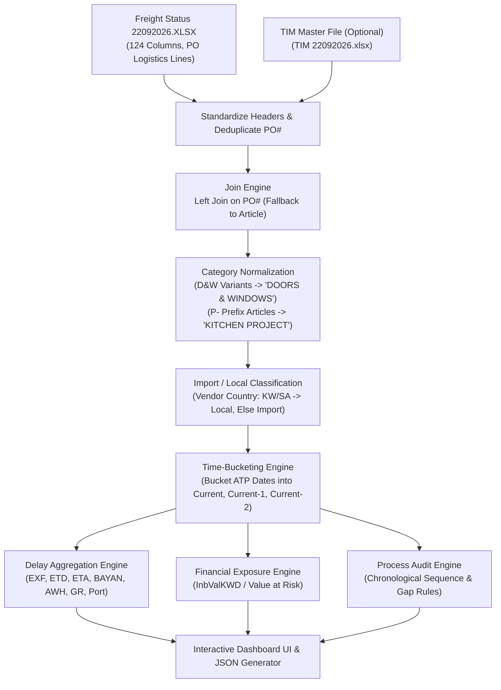

# Logistics & Freight Analytics System Reference: Dash (`dash.md`)

Comprehensive analysis and mathematical formula reference for the **Dash** repository ([GitHub Repo](https://github.com/Lone-Warrrior14/dash)).

This document covers the end-to-end data pipeline built around **`Freight Status (date).XLSX`** (and optionally enriched with **`TIM (date).xlsx`**). It outlines the ingestion architecture, time-bucketing algorithms, delay calculations, multi-stage logistics milestones, financial exposure metrics, data compliance audit rules, and AI insight generation formulas implemented in `app.py` and `generate_dashboard.py`.

---

## 1. System Purpose & Core Objective

The **Dash** application is an enterprise logistics and freight operations monitoring platform. It ingests international and local supply chain shipment trackers (`Freight Status 22092026.XLSX`) to provide:

1. **Supply Chain Delay Tracking:** PO-level and milestone-level monitoring across international and local logistics stages.
2. **Import vs. Local Separation:** Clear distinction between domestic and international supply lines.
3. **Financial Capital at Risk:** Aggregating committed invoice values tied to delayed shipments.
4. **Time-Bucketing & Rolling Horizon:** Automatic categorization of open orders into `Current`, `Current-1`, and `Current-2` months.
5. **Data Quality & Anomaly Auditing:** Identifying out-of-sequence milestone timestamps and missing master data.
6. **Executive & AI Strategic Insights:** Automated diagnosis of operational friction points.

---

## 2. Ingestion & Preprocessing Pipeline

---

## 3. Data Cleaning & Normalization Rules

### A. Column Name Standardizations
- `"ATP - formula (no negative"` $\rightarrow$ `"ATP"`
- `"Vendor Ctry.1"` $\rightarrow$ `"Vendor Country Name"`

### B. Category Normalization
- All variations of Doors & Windows:
  `["D&W PRODUCTION", "D&W PRODUCTIONS", "DOORS & WINDOWS", "DOORS AND WINDOWS"]`  
  are standardized strictly to **`"DOORS & WINDOWS"`**.
- Project Kitchen Orders:
  Any line item where `Article` begins with the prefix `"P-"` is classified as **`"KITCHEN PROJECT"`**.

### C. Import vs. Local Classification
Based on the supplier's country (`Vendor Country Name` or `Vendor Ctry`):
$$\text{Import / Local} = \begin{cases} \text{"Local"}, & \text{if Vendor Country} \in \{\text{"KUWAIT"}, \, \text{"SAUDI ARABIA"}, \, \text{"KW"}, \, \text{"SA"}\} \\ \text{"Import"}, & \text{otherwise} \end{cases}$$

---

## 4. Complete Formula Inventory

### A. Time-Bucketing Formulas (`merge_and_categorize_months`)
The platform dynamically partitions orders relative to the current calendar month:

- Let $M_0 = \text{Start of Current Month}$ (Day 1 at 00:00:00).
- $M_0^{\text{end}} = M_0 + 1\text{ Month}$
- $M_1 = M_0 - 1\text{ Month}$ (Start of Current-1)
- $M_2 = M_0 - 2\text{ Months}$ (Start of Current-2)

$$\text{Month\_Bucket} = \begin{cases} \text{"Out of Scope"}, & \text{if } \text{ATP} \ge M_0^{\text{end}} \text{ or } \text{ATP is null} \\ \text{"Current"}, & \text{if } M_0 \le \text{ATP} < M_0^{\text{end}} \\ \text{"Current-1"}, & \text{if } M_1 \le \text{ATP} < M_0 \\ \text{"Current-2"}, & \text{if } M_2 \le \text{ATP} < M_1 \\ \text{"Older"}, & \text{if } \text{ATP} < M_2 \end{cases}$$

> **Active Scope Filter:**  
> The dashboard retains strictly rows where $\text{Month\_Bucket} \in \{\text{"Current"}, \, \text{"Current-1"}, \, \text{"Current-2"}\}$.  
> *(If all rows fall outside due to historical data, the reference point shifts to $\max(\text{ATP Date})$)*.

---

### B. PO-Level Logistics Delay Formulas (`compute_po_input_delay`)

The system monitors 7 discrete supply chain milestones:
$$\text{Milestones} = \{\text{EXF Delay}, \, \text{ETD Delay}, \, \text{ETA Delay}, \, \text{BAYAN Delay}, \, \text{AWH Delay}, \, \text{GR Delay}, \, \text{Port Delay}\}$$

1. **Clipped Milestone Delay per PO:**
   Because a single PO may contain multiple line items, each milestone delay is aggregated at the distinct PO level using the maximum value, clipped at 0 (early arrivals do not offset positive delays):
   $$\text{Delay}_{\text{stage}}(\text{PO}) = \max_{\text{lines} \in \text{PO}}\big(\max(0, \, \text{Stage Delay}_{\text{line}})\big)$$

2. **Total Delay Days for a PO:**
   $$\text{Total Delay}(\text{PO}) = \sum_{\text{stage} \in \text{Milestones}} \text{Delay}_{\text{stage}}(\text{PO})$$

3. **PO Operational Status:**
   $$\text{PO Status} = \begin{cases} \text{"Delayed"}, & \text{if Total Delay}(\text{PO}) > 0 \\ \text{"On Time"}, & \text{if Total Delay}(\text{PO}) = 0 \end{cases}$$

4. **Aggregate Delay Counts (Unique PO Counts per Milestone):**
   $$\text{Count}_{\text{stage}} = \big|\{\text{PO} \mid \text{Stage Delay}(\text{PO}) > 0\}\big|$$

   $$\text{Total Delay Count} = \sum_{\text{stage}} \text{Count}_{\text{stage}}$$

5. **Tracking Delay Rate (\%):**
   $$\text{Tracking Delay Rate \%} = \frac{\text{Total Delayed PO Count}}{\text{Total Distinct Audited POs}} \times 100$$

---

### C. Financial Risk & Capital at Risk Exposure

Calculated separately for **Import** and **Local** supply streams using `InbValKWD` (or `Value`):

1. **Gross Financial Portfolio Value:**
   $$\text{Gross Value} = \sum_{\text{all rows}} \text{InbValKWD}$$

2. **Delayed Value at Risk (Capital Exposed to Over All Delay):**
   $$\text{Value at Risk} = \sum_{\substack{\text{rows where} \\ \text{Over All Delay} > 0}} \text{InbValKWD}$$

3. **Financial Risk Rate (\%):**
   $$\text{Financial Risk Rate \%} = \begin{cases} \frac{\text{Value at Risk}}{\text{Gross Value}} \times 100, & \text{if Gross Value} > 0 \\ 0.0\%, & \text{otherwise} \end{cases}$$

4. **Average Delay Days (Delayed Subset):**
   $$\text{Average Delay Days} = \frac{1}{N_{\text{delayed}}} \sum_{\substack{\text{rows where} \\ \text{Over All Delay} > 0}} \text{Over All Delay}$$

5. **Financial Exposure Breakdown by Country & Category:**
   $$\text{Value at Risk}(\text{Group}) = \sum_{\substack{\text{rows in Group where} \\ \text{Over All Delay} > 0}} \text{InbValKWD}$$

---

### D. Data Integrity & Anomaly Audit Rules (`process_excel_validator`)

The validation engine runs 10 compliance rules to identify chronological impossibilities and master data gaps:

| Rule Code | Friendly Rule Name | Trigger Condition | Severity (Import / Local) |
| :--- | :--- | :--- | :---: |
| `ATP_BEFORE_GRP` | ATP Date is before GRP Date | $\text{ATP} < \text{GRP}$ | Severe / Medium |
| `ATP_BEFORE_AWH` | ATP Date is before AWH Date | $\text{ATP} < \text{AWH}$ | Severe / Medium |
| `ATP_BEFORE_BAYAN` | ATP Date is before BAYAN Date | $\text{ATP} < \text{BAYAN}$ | Severe / Medium |
| `ATP_BEFORE_ETA` | ATP Date is before ETA Date | $\text{ATP} < \text{ETA}$ | Severe / Medium |
| `ATP_BEFORE_ETD` | ATP Date is before ETD Date | $\text{ATP} < \text{ETD}$ | Severe / Medium |
| `ATP_GRP_GAP_GT_5` | ATP to GRP Gap exceeds 5 Days | $(\text{ATP} - \text{GRP}) > 5\text{ days}$ | Severe / Medium |
| `TIM_UNMATCHED_PO`| Open PO lacks matching TIM Master | `_has_tim_match` is False | Severe / Medium |
| `TIM_MISSING_PLANNER`| Missing TIM Planner Assignment | `Planner Code` $\in$ {null, "Unassigned", "Unknown"} | Severe / Medium |
| `TIM_STATUS_MISMATCH`| Article Status Mismatch vs TIM | $\text{Status}_{\text{PO}} \ne \text{Status}_{\text{TIM}}$ | Severe / Medium |
| `TIM_CATEGORY_MISMATCH`| Conflicting Category vs TIM | $\text{Category}_{\text{PO}} \ne \text{Category}_{\text{TIM}}$ | Severe / Medium |

#### Anomaly Summary Metrics:
- **Total Audited POs:** $N_{\text{audited}} = |\text{unique PO\# in file}|$
- **Violations per Rule:** $\text{Count}_{\text{rule}} = |\text{unique PO\# violating Rule}|$
- **Violation Percent:** $\text{Percent}_{\text{rule}} = \frac{\text{Count}_{\text{rule}}}{N_{\text{audited}}} \times 100$
- **Total Process Anomaly Rate:**
  $$\text{Data Anomaly Rate \%} = \frac{\big|\{\text{PO} \mid \text{Issue Count}(\text{PO}) > 0\}\big|}{N_{\text{audited}}} \times 100$$

---

### E. TIM-Driven Aggregations & Month Bucket Trends

When joined with the TIM master dataset:

1. **Volume Analysis by Material Group:**
   $$\text{Total POs}(\text{Group}) = \big|\{\text{PO\#} \in \text{Group}\}\big|$$
   $$\text{Total Value KWD}(\text{Group}) = \sum_{\text{Group}} \text{InbValKWD}$$

2. **Delay Matrix by Planner Code:**
   For each planner code and delay stage:
   $$\text{Delays}(\text{Planner}, \text{Stage}) = \big|\{\text{PO\#} \in \text{Planner} \mid \text{Stage Delay} > 0\}\big|$$

3. **Month Bucket Trend Line:**
   For each bucket $b \in \{\text{Current}, \, \text{Current-1}, \, \text{Current-2}\}$:
   $$\text{Delay Rate}(b) = \frac{\text{Delayed POs}(b)}{\text{Total Volume POs}(b)} \times 100$$

---

## 5. Output Artifacts & Deliverables

1. **Interactive Single-Page Application (`dashboard.html` / `dashboard_data.js`):**  
   Stand-alone dashboard with dark-glass aesthetic, interactive slicers (Country, Category, Vendor, Import/Local), KPI cards, and vendor delay matrices.
2. **Validation Output Directories (`process_excel_validator`):**
   - `/Summary/Validation_Summary.xlsx`: High-level compliance violation matrix.
   - `/ATP_Before_Event/`: Individual Excel files for each chronological date anomaly.
   - `/Gap_Validation/ATP_GRP_GAP_GT_5.xlsx`: PO lines with excessive dock-to-stock delays.
   - `/TIM_Master_Mismatches/`: Missing planner codes and unmapped PO lines.
   - `/Master/All_Anomalies.xlsx`: Unified exception audit log with Row IDs.
   - `/new_file/`: Cleaned and category-standardized dataset exports.
