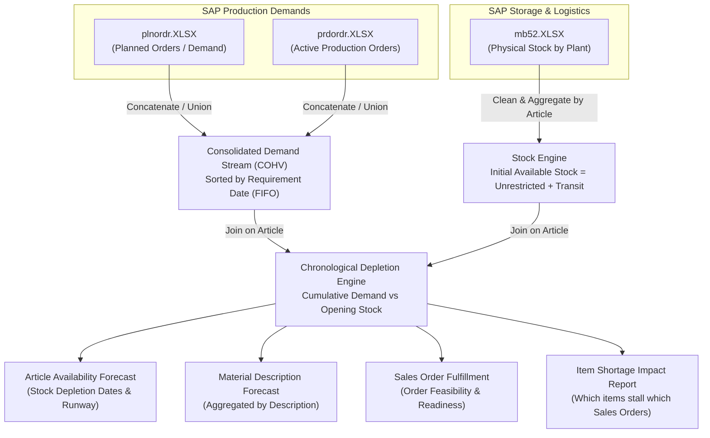

# System Architecture & Formula Reference: Harsh2 (`harsh2.md`)

Comprehensive analysis and mathematical formula reference for the **Harsh2** system ([GitHub Repo](https://github.com/Lone-Warrrior14/harsh2)).

This document details how **`mb52.XLSX`**, **`plnordr.XLSX`**, and **`prdordr.XLSX`** connect together, the data flow, filtering business rules, chronological demand fulfillment engines, and every exact formula used in both `app.py` and `availability_app.py`.

---

## 1. System Purpose & Core Objective

The **Harsh2** project is an operational **Shortage & Product Availability Predictor** designed for manufacturing lines (Doors & Windows and Kitchens). It connects:
1. **Current Warehouse Physical Stock (`mb52.XLSX`):** On-hand unrestricted and transit stock by plant and storage location.
2. **Planned Production Orders (`plnordr.XLSX` / COHV Planned):** Forward material demand from projected assembly orders.
3. **Active Production Orders (`prdordr.XLSX` / COHV Production):** Firm shop-floor work orders requiring components.

It determines:
- Which Sales Documents (Customer Orders) and Production Orders have 100% material coverage vs. partial/complete stockout.
- The exact **Stock Depletion Date** when an article will run dry on the shop floor.
- The prioritized list of bottleneck components causing the largest manufacturing stoppage.

---

## 2. Source Files & How They Connect

### Joining Keys:
- **`Article` (Material ID / `MATNR`):** Stripped of whitespace, leading zeros, and trailing `.0` formatting to ensure reliable left/inner joins between SAP extracts.
- **`Sales Document` (`VBELN`):** Customer order tracking anchor across all requirement lines.
- **`Material Description` (`MAKTX`):** Secondary grouping for multi-article variants.

---

## 3. Data Cleaning & Business Exclusion Rules

Before calculations run, Harsh2 applies crucial production filtering rules:

1. **Phantom Item Exclusion:**
   $$\text{Filter: } \text{Phantom item} \ne \text{'X'}$$
   *Reason:* Phantom items in SAP BOMs are logical placeholders/transient assemblies that are never physically stocked or picked from warehouse bins.
2. **Glass & Glazing Exclusion (`GLS` Filter):**
   $$\text{Filter: } \text{Material Description does NOT contain 'gls' (case-insensitive)}$$
   *Reason:* Glass panels follow separate just-in-time (JIT) direct-to-order sourcing and are not managed through standard warehouse inventory buffers.
3. **Hardcoded Inactive Articles Exclusion:**
   Articles `515284` and `515364` are explicitly filtered out.
4. **Inactive Catalog Items Removal:**
   Rows where $\text{Initial Available Stock} = 0 \text{ AND } \text{Total Demand} = 0$ are discarded.

---

## 4. Complete Formula Reference

### A. Total Available Inventory (`availability_app.py`)
In standard warehouse planning, goods in transit are already committed to the plant:

$$\text{Total Available Stock} = \text{Unrestricted Stock} + \text{Transit/Transfer Stock}$$

$$\text{Total Stock Value} = \text{Value Unrestricted} + \text{Value Transit}$$

$$\text{Unit Price} = \begin{cases} \frac{\text{Total Stock Value}}{\text{Total Available Stock}}, & \text{if Total Available Stock} > 0 \\ 0.0, & \text{otherwise} \end{cases}$$

---

### B. Chronological FIFO Demand Allocation (Line-by-Line)
Demands are ordered strictly chronological by **`Requirement date`** (earliest first), then by `Sales Document`:

1. **Cumulative Demand:**
   $$\text{Cumulative Demand}_i = \sum_{k=1}^{i} \text{Requirement Quantity}_k \quad (\text{for a given Article})$$

2. **Projected Ending Stock Balance:**
   $$\text{Projected Stock Balance}_i = \text{Initial Available Stock} - \text{Cumulative Demand}_i$$

3. **Opening Stock Balance Available for Line $i$:**
   $$\text{Opening Stock Balance}_i = \text{Projected Stock Balance}_i + \text{Requirement Quantity}_i$$

4. **Fulfilled Quantity for Line $i$:**
   $$\text{Fulfilled Qty}_i = \min\Big(\text{Requirement Quantity}_i, \, \max\big(0, \, \text{Opening Stock Balance}_i\big)\Big)$$

5. **Shortage Quantity for Line $i$:**
   $$\text{Shortage Qty}_i = \text{Requirement Quantity}_i - \text{Fulfilled Qty}_i$$

6. **Line Item Status:**
   $$\text{Line Status} = \begin{cases} \text{"FULLY COVERED ON TIME"}, & \text{if Fulfilled Qty} = \text{Requirement Quantity} \\ \text{"PARTIALLY COVERED"}, & \text{if Fulfilled Qty} > 0 \\ \text{"STOCKOUT / UNFULFILLABLE"}, & \text{if Fulfilled Qty} = 0 \end{cases}$$

---

### C. Stock Depletion Date & Runway Days
The engine pinpoints the exact date inventory reaches zero:

$$\text{Stock Depletion Date} = \min_{\substack{\text{all lines where} \\ \text{Projected Stock Balance} < 0}} \big(\text{Requirement Date}\big)$$

$$\text{Days Until Depletion} = \text{Stock Depletion Date} - \text{Current Date}$$

If $\text{Net Balance} \ge 0$ across all scheduled demands:
$$\text{Status} = \text{"No Depletion Expected"} \quad (\text{Days} = 999)$$

If $\text{Initial Stock} \le 0 \text{ and Demand} > 0$:
$$\text{Status} = \text{"Immediate Depletion / 0 Start Stock"} \quad (\text{Days} \le 0)$$

---

### D. Article-Level Aggregate Metrics

1. **Net Projected Stock Balance:**
   $$\text{Net Projected Balance} = \text{Initial Available Stock} - \text{Total Future Demand}$$

2. **Stock Coverage Percentage:**
   $$\text{Stock Coverage \%} = \begin{cases} \min\left(100.0, \, \frac{\text{Total Fulfilled Qty}}{\text{Total Future Demand}} \times 100\right), & \text{if Total Future Demand} > 0 \\ 100.0, & \text{otherwise} \end{cases}$$

3. **Total Demand Valuation:**
   $$\text{Total Demand Value} = \text{Total Future Demand} \times \text{Unit Price}$$

4. **Total Shortage Valuation:**
   $$\text{Total Shortage Value} = \text{Total Shortage Qty} \times \text{Unit Price}$$

5. **Article Status Classification:**
   $$\text{Article Status} = \begin{cases} \text{"CRITICAL STOCKOUT"}, & \text{if Initial Stock} \le 0 \text{ and Total Demand} > 0 \\ \text{"STOCKOUT RISK"}, & \text{if Net Projected Balance} < 0 \\ \text{"SUFFICIENT STOCK"}, & \text{if Net Projected Balance} \ge 0 \end{cases}$$

---

### E. Sales Order (Customer SIC) Fulfillment Formulas

1. **Sales Order Fulfillment Percentage:**
   $$\text{SO Fulfillment \%} = \begin{cases} 100.0\%, & \text{if Shortage Qty} \le 0.0001 \\ \min\left(99.9\%, \, \frac{\text{Deliverable Qty}}{\text{Total Ordered Qty}} \times 100\right), & \text{otherwise} \end{cases}$$

2. **Sales Order Operational Status:**
   $$\text{SO Status} = \begin{cases} \text{"READY FOR FULL DELIVERY"}, & \text{if Shortage Qty} \le 0.0001 \\ \text{"PARTIAL DELIVERY RISK"}, & \text{if Deliverable Qty} > 0.0001 \\ \text{"UNFULFILLABLE (NO STOCK)"}, & \text{if Deliverable Qty} \le 0.0001 \end{cases}$$

---

### F. Executive KPI Formulas (`availability_app.py`)

1. **Overall Factory Fulfillment Rate:**
   $$\text{Overall Fulfillment Rate \%} = \frac{\text{Total Demand Qty} - \text{Total Shortage Qty}}{\text{Total Demand Qty}} \times 100$$

2. **Days on Hand (DOH / Runway based on 30-day run rate):**
   $$\text{Daily Demand Value} = \frac{\text{Total Demand Value}}{30}$$

   $$\text{Days on Hand (DOH)} = \begin{cases} \frac{\text{Total Stock Value}}{\text{Daily Demand Value}}, & \text{if Daily Demand Value} > 0 \\ 999.0, & \text{if Daily Demand Value} = 0 \text{ and Total Stock Value} > 0 \\ 0.0, & \text{otherwise} \end{cases}$$

---

## 5. Output Reports Generated by Harsh2

When running in Harsh2, the calculation engine produces multi-tab Excel reports:

1. **`Material_Description_Forecast`:** Consolidated view by material trade name, aggregating multiple item codes.
2. **`Article_Availability_Forecast`:** SKU-by-SKU breakdown with starting stock, future demand, shortage, depletion date, and coverage %.
3. **`Sales_Order_Fulfillment`:** Grouped by `Sales Document` showing delivery readiness and feasibility.
4. **`Chronological_Timeline`:** Full event audit log showing cumulative stock consumption order-by-order.
5. **`SO_Shortage_Details`:** Filtered list isolating only lines suffering material shortage.
6. **`Item_Shortage_Impact_Report`:** High-priority matrix showing each bottleneck item alongside the exact list of customer Sales Documents stalled by it.
